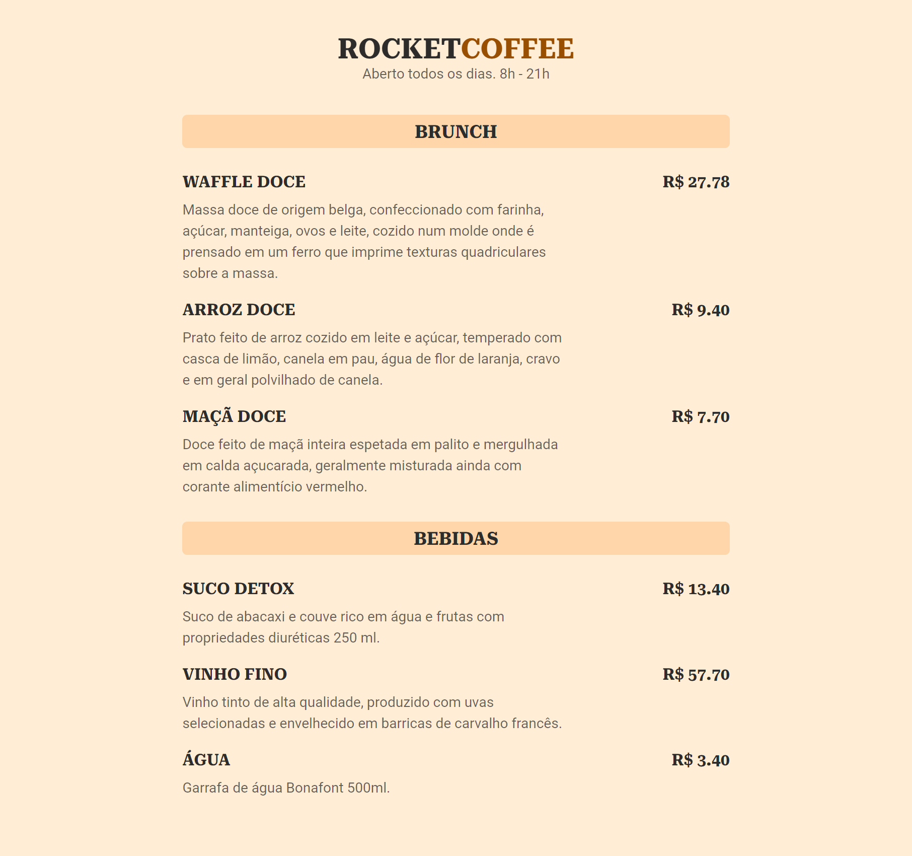

<h1 align="center">
  ☕ <b>RocketCoffee</b>
</h1>

  

## 🚀 Tecnologias

Esse projeto foi desenvolvido com as seguintes tecnologias:

- 
- 

## 💻 Projeto

RocketCoffee é um cardápio online para utilizar em negócios no ramo de alimentação.

Você pode visualizar o projeto em funcionamento através do link abaixo:

- **[RocketCoffee](https://cardapio-rocketcoffee.vercel.app/)**

## 🔖 Layout

Você pode visualizar o layout do projeto através [desse link](https://www.figma.com/community/file/1138209866997102496). É necessário ter conta no [Figma](https://figma.com) para acessá-lo.

---

Este projeto foi desenvolvido durante a **[Maratona Explorer 3.0](https://lp.rocketseat.com.br/inscricao/maratona-explorer)**, realizada pela **[@Rocketseat 💜](https://github.com/Rocketseat)**.
